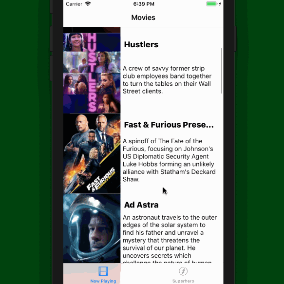
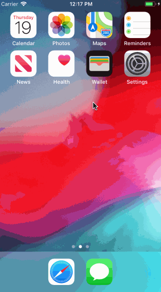
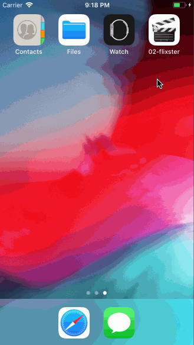

# Flix

Flix is an app that allows users to browse movies from the [The Movie Database API](http://docs.themoviedb.apiary.io/#).

# Lab 3 - *Flix*

Time spent: **1** hour spent in total

## User Stories

The following **required** user stories are complete:

- The following screens use AutoLayout to adapt to various orientations and screen sizes
- [X] Movie feed view (+3pt)
- [ ] Detail view (+2pt)

The following **stretch** user stories are implemented:

- [ ] Dynamic Height Cells (+1)
- [ ] Collection View AutoLayout (+2)

The following **additional** user stories are implemented:

- [ ] List anything else that you can get done to improve the app functionality! (+1-3pts)

Please list two areas of the assignment you'd like to **discuss further with your peers** during the next class (examples include better ways to implement something, how to extend your app in certain ways, etc):

1. I could not figure out how to use contraints properly
2.

## Video Walkthrough

Here's a walkthrough of implemented user stories:

## Notes

Contraints were confusing and I could not figure out how to get them right

## License

Copyright [2019] [Chris Vitale]

## Flix Part 2

### User Stories

#### REQUIRED (10pts)
- [X] (5pts) User can tap a cell to see more details about a particular movie.
- [X] (5pts) User can tap a tab bar button to view a grid layout of Movie Posters using a CollectionView.

#### BONUS
- [ ] (2pts) User can tap a poster in the collection view to see a detail screen of that movie.
- [ ] (2pts) In the detail view, when the user taps the poster, a new screen is presented modally where they can view the trailer.

### App Walkthough GIF

 

### Notes
Finding the API 

---

## Flix Part 1

### User Stories

#### REQUIRED (10pts)
- [X] (2pts) User sees an app icon on the home screen and a styled launch screen.
- [X] (5pts) User can view and scroll through a list of movies now playing in theaters.
- [X] (3pts) User can view the movie poster image for each movie.

#### BONUS
- [ ] (2pt) User can view the app on various device sizes and orientations.
- [ ] (1pt) Run your app on a real device.

### App Walkthough GIF

 

### Notes
Getting the constraints right was difficult

